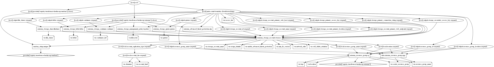

# Azure Storage Account

[](https://github.com/hashicorp/terraform/releases) [](https://github.com/kumarvna/cloudascode/blob/master/LICENSE)

Terraform Module to create an Azure storage account with a set of containers (and access level), set of file shares (and quota), static website with CDN service. Few of these resources added/excluded as per your requirement.

You can configure your storage account to accept requests from secure connections only by setting the `enable_https_traffic_only = true` for the storage account. By default, this property is enabled when you create a storage account using this module.

To defines the kind of account, set the argument to `account_kind = "StorageV2"`. Account kind defaults to `StorageV2`. If you want to change this value to other storage accounts kind, then this module automatically computes the appropriate values for `account_tier`, `account_replication_type`. The valid options are `BlobStorage`, `BlockBlobStorage`, `FileStorage`, `Storage` and `StorageV2`.

Note: *static_website can only be set when the account_kind is set to StorageV2.*

For more details, check [Microsoft Azure Documentation](https://docs.microsoft.com/en-us/azure/storage/common/storage-account-overview)

## These types of resources are supported

* [Storage Account](https://www.terraform.io/docs/providers/azurerm/r/storage_account.html)

* [Containers](https://www.terraform.io/docs/providers/azurerm/r/storage_container.html)

* [SMB File Shares](https://www.terraform.io/docs/providers/azurerm/r/storage_share.html)

## Module Usage

Following example to create a storage account with a few containers.

```
module "storageacc" {
  source                  = "github.com/tietoevry-infra-as-code/terraform-azurerm-storage?ref=v1.0.0"
  create_resource_group   = false
  resource_group_name     = "rg-demo-westeurope-01"
  location                = "westeurope"
  storage_account_name    = "storageaccwesteupore01"

# Container lists wiht access_type to create
  containers_list = [
    { name        = "mystore250"
      access_type = "private"},
    { name        = "blobstore251"
      access_type = "blob"},
    { name      = "containter252"
      access_type = "container"}
  ]

  tags = {
    application_name      = "demoapp01"
    owner_email           = "user@example.com"
    business_unit         = "publiccloud"
    costcenter_id         = "5847596"
    environment           = "development"
  }
}
```

## Create resource group

By default, this module will not create a resource group and the name of an existing resource group to be given in an argument `create_resource_group`. If you want to create a new resource group, set the argument `create_resource_group = true`.

*If you are using an existing resource group, then this module uses the same resource group location to create all resources in this module.*

## BlockBlobStorage accounts

A BlockBlobStorage account is a specialized storage account in the premium performance tier for storing unstructured object data as block blobs or append blobs. Compared with general-purpose v2 and BlobStorage accounts, BlockBlobStorage accounts provide low, consistent latency and higher transaction rates.

BlockBlobStorage accounts don't currently support tiering to hot, cool, or archive access tiers. This type of storage account does not support page blobs, tables, or queues.

To create BlockBlobStorage accounts, set the argument to `account_kind = "BlockBlobStorage"`.

## FileStorage accounts

A FileStorage account is a specialized storage account used to store and create premium file shares. This storage account kind supports files but not block blobs, append blobs, page blobs, tables, or queues.

FileStorage accounts offer unique performance dedicated characteristics such as IOPS bursting. For more information on these characteristics, see the File share storage tiers section of the Files planning guide.

To create BlockBlobStorage accounts, set the argument to `account_kind = "FileStorage"`.

## Containers

A container organizes a set of blobs, similar to a directory in a file system. A storage account can include an unlimited number of containers, and a container can store an unlimited number of blobs. The container name must be lowercase.

This module creates the containers based on your input within an Azure Storage Account.  Configure the `access_type` for this Container as per your preference. Possible values are `blob`, `container` or `private`. Preferred Defaults to `private`.

## SMB File Shares

Azure Files offers fully managed file shares in the cloud that are accessible via the industry standard Server Message Block (SMB) protocol. Azure file shares can be mounted concurrently by cloud or on-premises deployments of Windows, Linux, and macOS.

This module creates the SMB file shares based on your input within an Azure Storage Account.  Configure the `quota` for this file share as per your preference. The maximum size of the share, in gigabytes. For Standard storage accounts, this must be greater than `0` and less than `5120` GB (5 TB). For Premium FileStorage storage accounts, this must be greater than `100` GB and less than `102400` GB (100 TB).

## `sensitive` — Suppressing Values in CLI Output

An output can be marked as containing sensitive material using the optional `sensitive = true` argument in the output declration.

Setting an output value in the root module as sensitive prevents Terraform from showing its value in the list of outputs at the end of `terraform apply`. It might still be shown in the CLI output for other reasons, like if the value is referenced in an expression for a resource argument.

Sensitive output values are still recorded in the [state](https://www.terraform.io/docs/state/index.html), and so will be visible to anyone who is able to access the state data. Storing state remotely can provide better security. For more information, see [Sensitive Data in State.](https://www.terraform.io/docs/state/sensitive-data.html)

## Inputs

Name | Description | Type | Default
---- | ----------- | ---- | -------
`create_resource_group` | Whether to create resource group and use it for all networking resources | string | `"false"`
`resource_group_name`|The name of an existing resource group.|string|`"rg-demo-westeurope-01"`
`location`|The location for all resources while creating a new resource group.|string|`"westeurope"`
`account_kind`|General-purpose v2 accounts: Basic storage account type for blobs, files, queues, and tables.|string|`"StorageV2"`
`containers_list` | List of container|list|`[]`
`file_shares` | List of SMB file shares|list|`[]`
`Tags`|A map of tags to add to all resources|map|`{}`

### `Container` object (must have keys)

Name | Description | Type | Default
---- | ----------- | ---- | -------
`name` | Name of the container | string | `""`
`access_type` | The Access Level configured for the Container. Possible values are `blob`, `container` or `private`.|string|`"private"`

### `SMB file Shares` objects (must have keys)

Name | Description | Type | Default
---- | ----------- | ---- | -------
`name` | Name of the SMB file share | string | `""`
`quota` | The required size in GB. Defaults to `5120`|string|`""`

## Outputs

Name | Description
---- | -----------
`resource_group_name` | The name of the resource group in which resources are created
`resource_group_id` | The id of the resource group in which resources are created
`resource_group_location`| The location of the resource group in which resources are created
`storage_account_id` | The ID of the storage account
`sorage_account_name`| The name of the storage account
`storage_primary_connection_string`|The primary connection string for the storage account
`storage_primary_access_key`|The primary access key for the storage account
`containers` | The list of containers
`file_shares` | The list of SMB file shares

## Resource Graph



## Authors

Module is maintained by [Kumaraswamy Vithanala](mailto:kumaraswamy.vithanala@tieto.com) with the help from other awesome contributors.

## Other resources

* [Azure Storage documentation](https://docs.microsoft.com/en-us/azure/storage/)

* [Terraform AzureRM Provider Documentation](https://www.terraform.io/docs/providers/azurerm/index.html)